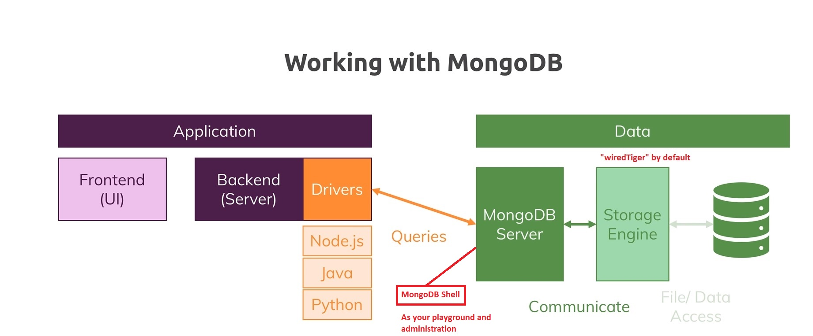

# Introduction 
This is a repo created for storing any useful information about MongoDB.

Section - 1: Introduction

* MongoDB Data structure:  

* MongoDB data format (document-oriented storage format):

* BSON data-format and what is under the hood:

* MongoDB Ecosystem:

* Work with MongoDB:

* Implicit operations in Mongo:

## Start working with MongoDB

To add mongo command to your command line:  
<b> win - environment variables - advanced tab - environment variables</b>  
Add here a path to your mongoDB.

[useful link](https://dangphongvanthanh.wordpress.com/2017/06/12/add-mongos-bin-folder-to-the-path-environment-variable/)

<b>BTW</b>, to continue working with course you have to stop MongoDB service and start db manually
using "mongo" command from console. Without it "mongo" command will open mongo service instead of real db.

to stop service - open CMD as admin and `net stop Mongo`

<b>Last step:</b>  
* To make default data storage location: create "data" folder in C: drive and put folder "db" within.
* Otherwise: create another directory (i.e. D:\mongodb-data\db) and put command in cmd:
`mongod --dbpath D:\mongodb-data\db`

<b>Pay attention:</b>
You have to leave your process running (cmd console should be opened) to work with mongoDB service.

* CMD - `mongo`

And now you are in the mongo shell where you can run your commands and queries.

Section - 1: Simple commands

* `show dbs` - will show existing dbs in selected repository (`--dbpath D:\mongodb-data\db`)
* `use Your_db_name` - will switch to db with selected name. If db does not exist - it will create it automatically.
* `db.products.insertOne({name: "A Book", price: 29.99})` - will create a table named products (it does not exist too) 
in db which we connected to and insert a document inside it.  
Pay attention on non-existing quotation mark in "keys" - you can use key naming without quotations, they will be added
under the hood.  

Here is a console output. InsertedId - generated uniqueId for this insert, acknowledged - verified that this data was inserted.

* `db.products.find()` - retrieves you all data from collection (from table in SQL world).
* `db.products.find().pretty()` - show this data formatted.

Section - 2: JSON-vs-BSON, Basics & CRUD operations

* Json vs Bson:

* You can set _id field manually and do not rely on autogenerated id.
BTW, you can't insert another document with the same _id.

* CRUD Operations:

