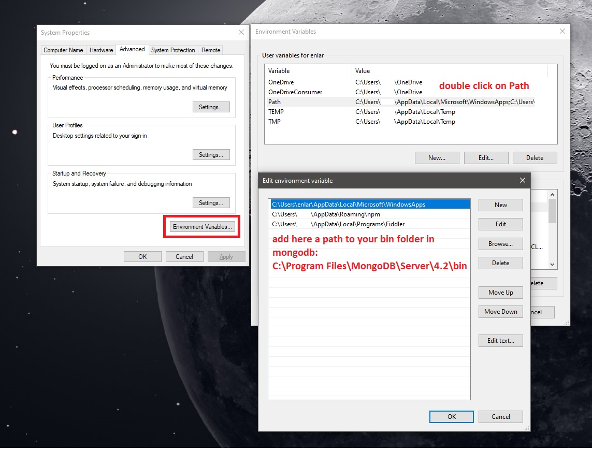

# Introduction 
This is a repo created for storing any useful information about MongoDB.

Section - 1: Introduction

MongoDB Data structure:

MongoDB data format (document-oriented storage format):

BSON data-format and what is under the hood:

MongoDB Ecosystem:

To add mongo command to your command line:  
<b> win - environment variables - advanced tab - environment variables</b>  
Add here a path to your mongoDB.

[useful link](https://dangphongvanthanh.wordpress.com/2017/06/12/add-mongos-bin-folder-to-the-path-environment-variable/)

BTW, to continue working with course you have to stop MongoDB service and start db manually
using "mongo" command from console. Without it "mongo" command will open mongo service instead of real db.

to stop service - open CMD as admin and "net stop Mongo"
Details:

<b>Last step:</b>  
* To make default data storage location: create "data" folder in C: drive and put folder "db" within.
* Otherwise: put command in cmd: <b>mongod --dbpath "D:\mongodb-data\db"</b>

<b>Pay attention:</b>
You have to leave your process running (cmd console should be opened) to work with mongoDB service.

* cmd - mongo

And now you are in the mongo shell where you can run your commands and queries.

