# Introduction 
This is a repo created for storing any useful information about MongoDB.

Section - 1: Introduction

* MongoDB Data structure:  

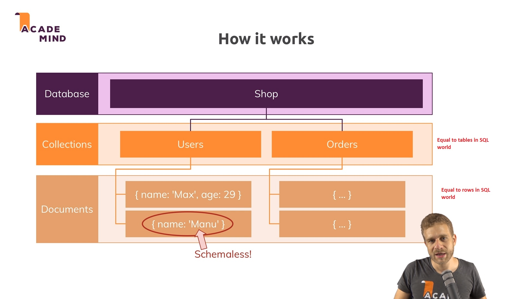

* MongoDB data format (document-oriented storage format):

* BSON data-format and what is under the hood:

* MongoDB Ecosystem:

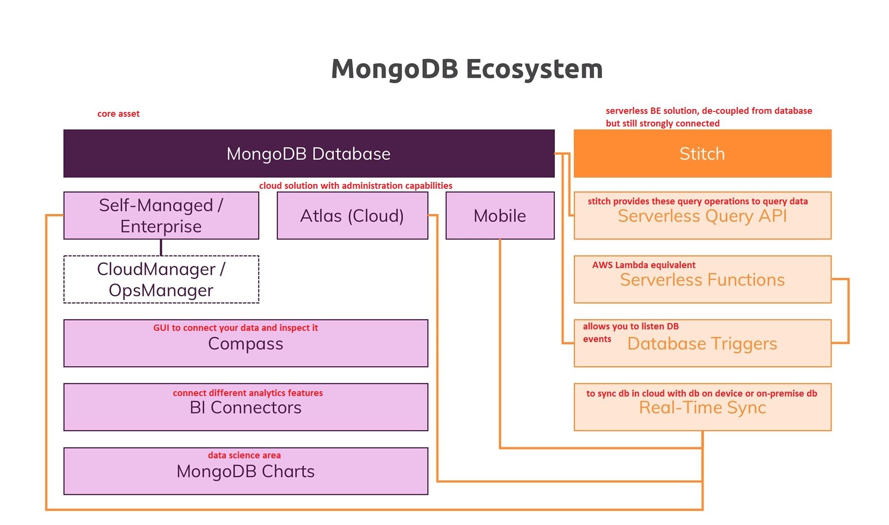

* Work with MongoDB:

* Implicit operations in Mongo:

## Start working with MongoDB

To add mongo command to your command line:  
<b> win - environment variables - advanced tab - environment variables</b>  
Add here a path to your mongoDB.

[useful link](https://dangphongvanthanh.wordpress.com/2017/06/12/add-mongos-bin-folder-to-the-path-environment-variable/)

<b>BTW</b>, to continue working with course you have to stop MongoDB service and start db manually
using "mongo" command from console. Without it "mongo" command will open mongo service instead of real db.

to stop service - open CMD as admin and `net stop Mongo`

<b>Last step:</b>  
* To make default data storage location: create "data" folder in C: drive and put folder "db" within.
* Otherwise: create another directory (i.e. D:\mongodb-data\db) and put command in cmd:
`mongod --dbpath D:\mongodb-data\db`

<b>Pay attention:</b>
You have to leave your process running (cmd console should be opened) to work with mongoDB service.

* CMD - `mongo`

And now you are in the mongo shell where you can run your commands and queries.

Section - 1: Simple commands

* `show dbs` - will show existing dbs in selected repository (`--dbpath D:\mongodb-data\db`)
* `use Your_db_name` - will switch to db with selected name. If db does not exist - it will create it automatically.
* `db.products.insertOne({name: "A Book", price: 29.99})` - will create a table named products (it does not exist too) 
in db which we connected to and insert a document inside it.  
Pay attention on non-existing quotation mark in "keys" - you can use key naming without quotations, they will be added
under the hood.  

Here is a console output. InsertedId - generated uniqueId for this insert, acknowledged - verified that this data was inserted.

* `db.products.find()` - retrieves you all data from collection (from table in SQL world).
* `db.products.find().pretty()` - show this data formatted.

Section - 2: JSON-vs-BSON, Basics & CRUD operations

### Summary

### Json vs Bson:

* You can set _id field manually and do not rely on autogenerated id.
BTW, you can't insert another document with the same _id.

## CRUD Operations:

### Read 
Simple filter: `db.flight.find({intercontinental: true}).pretty()`;
Greater than ($gt): `db.flight.find({distance: {$gt: 10000}}).pretty()`;
FindOne: `db.flight.findOne({distance: {$gt: 10000}})`

### InsertMany and Show results using find. Cursor  
Find does not show you all results, it shows you a cursor by default:  

* Bare in mind that mongodb will increment Id to keep the proper element's order. First came element will contain minor identifier:

### UpdateOne
`db.flight.updateOne({distance: 12000}, {$set: {marker: "new field delete"}})` - will update first document which contains distance: 12000.  
Pay attention on <b>$set</b> - all reserved words start from dollar sign. 
This operator means that you would like to update your document with new field.

### UpdateMany
`db.flight.updateMany({}, {$set: {marker: "to Delete!"}})` - empty curly braces `{}` mean all documents in collection.

### Update
`update` operation works like `updateMany`:  

As you may have noticed first modification using set to `delayed: true` has no modified results because our document already
has this value. When we changed the value to false - log shows us that our value has been changed.

The difference between them - you can use it without `$set` operator, update does accept this syntax.
But it works on another manner:
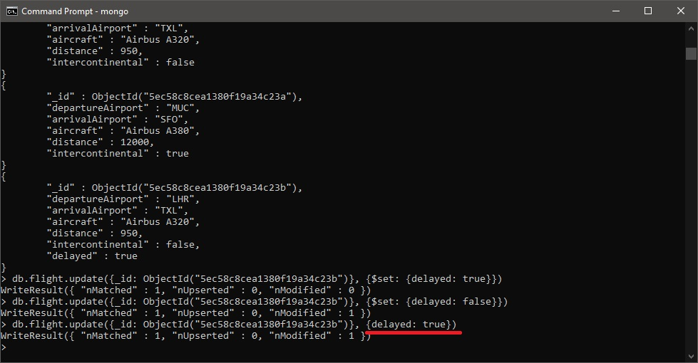

It will override all key-value pairs in document!

It works very close to `replaceOne`:

### Delete
`db.flight.deleteOne({departureAirport: "TXL"})` - departureAirport: "TXL" will be used as filter to find what exactly
 we want to delete from collection. Only first found document with "TXL" will be deleted.

### forEach
It is possible to use .forEach operation after find() to do something with every element after filtering:
`db.passengers.find().forEach((passengerData) => {printjson(passengerData)})` - bare in mind forEach uses syntax according
your MongoDB driver. Shell uses Nodejs syntax.

Pay attention:
That's why you cant use `pretty()` after findOne() method - `pretty()` is a method of a Cursor, findOne does not return cursor,
(and `pretty()` does not exist for a single value), findOne returns a sole value.

Section - 2: Projection

### Projection
Projection means a mechanism to avoid overfetching from database.  
You can use it as a parameter in `find` method:
* `find({}, {name: 1})` - first parameter is a filter, the second is projection. 1 means - "include this data".

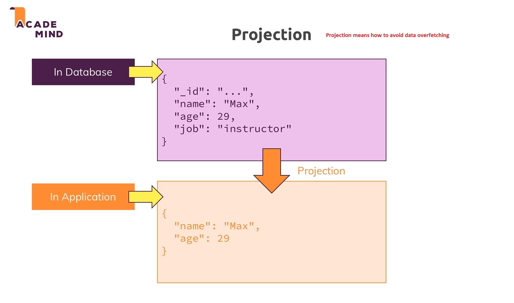
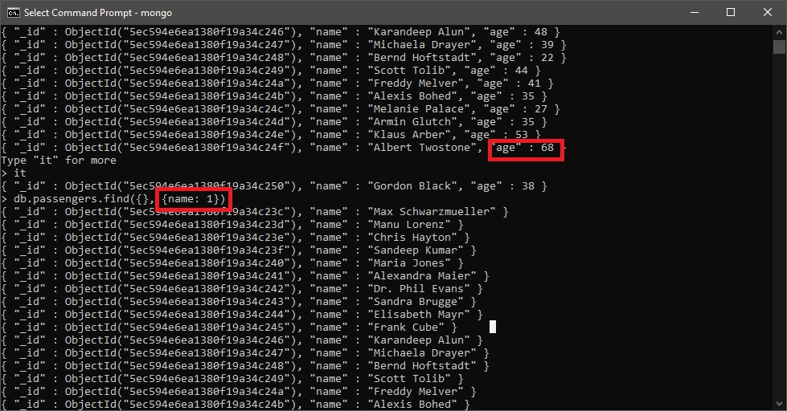

By default it will send you objects with _id (because it is a default property) and "name".

* To exclude _id (or any other field) - `find({}, {_id: 0})` - 0 means exclude.

To only name - `find({}, {name: 1, _id: 0})`/

Section - 2: Embedded Documents & Arrays

## Array examples:

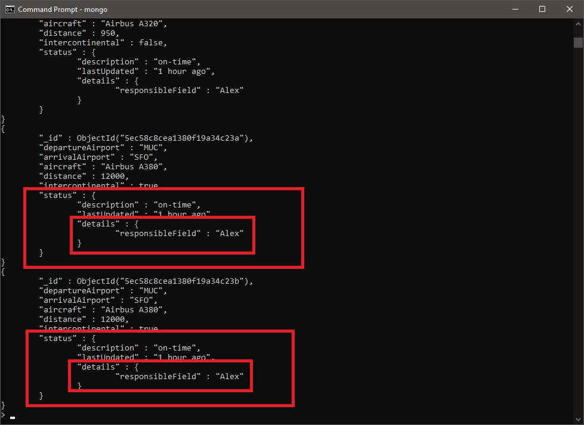
  
## Simple arrays with find method

## Array of objects with find method
to use find in embedded document you have to use ".":
`find({"status.description": "your_value"})`

description is an embedded document inside status.  
Pay attention that you must use double quotation around `status.description`.

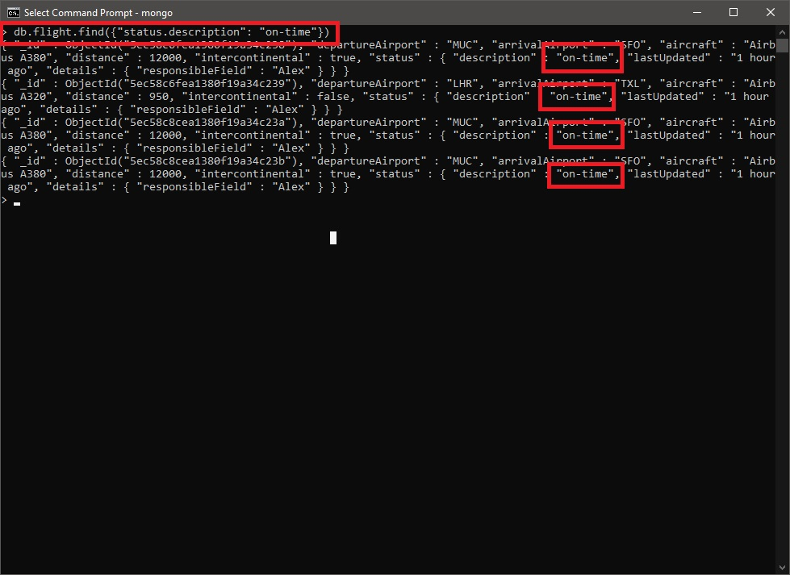
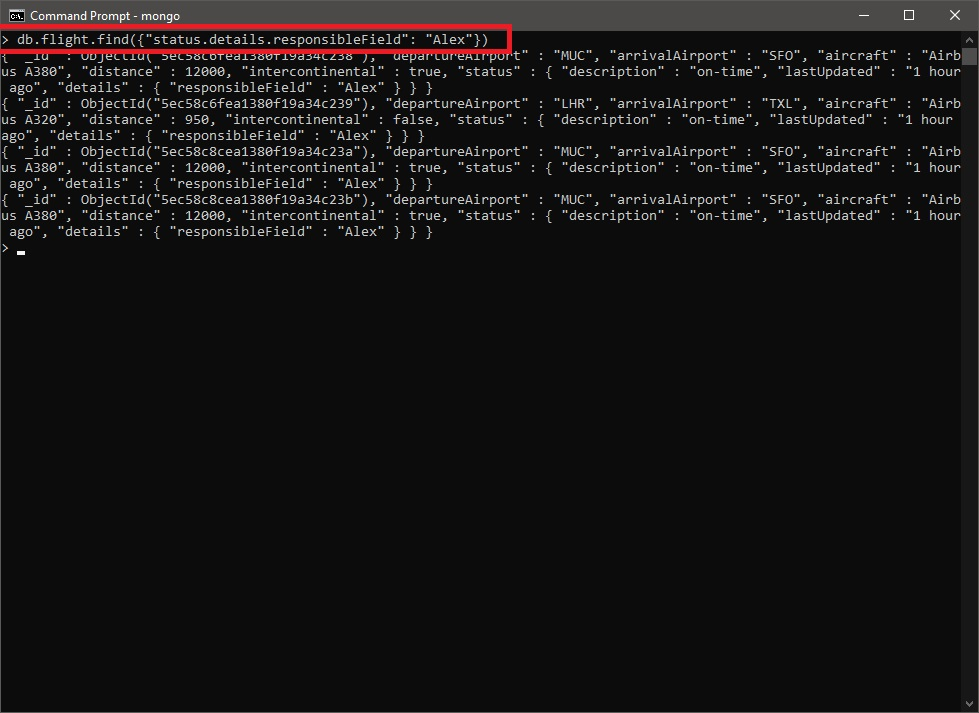

Section - 3: Schema Basis

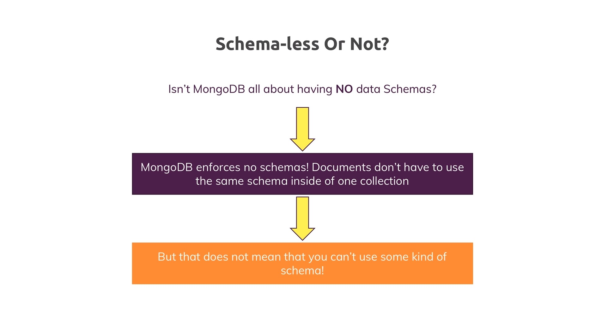

* SQL Approach (the same structure for all documents):  
You can assign null to your property. The value of such property will not be assign, but the property will be shown
in your data structure.
`db.products.insertOne({name: "Book", details: null})`

Section - 3: Data Schemas, Data Modelling

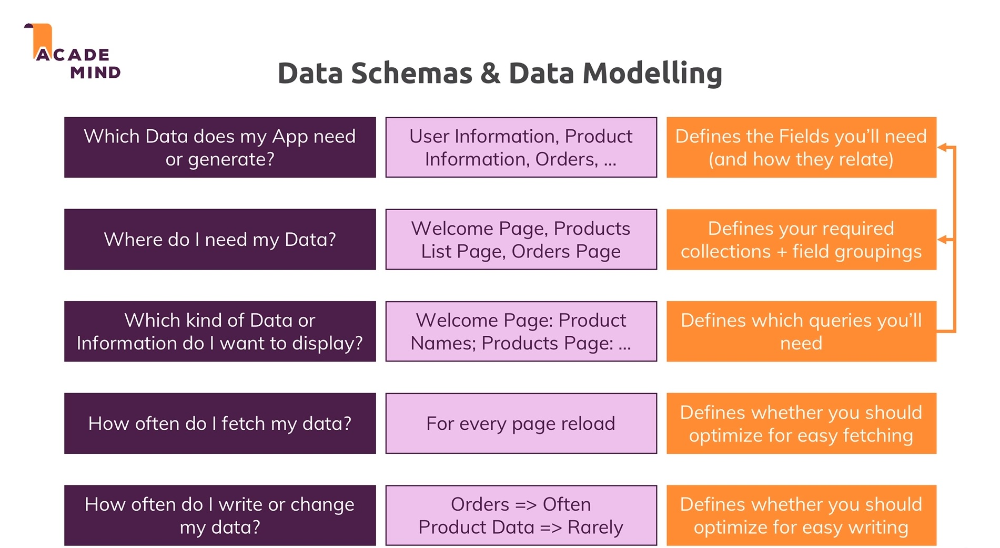

Section - 3: Data Types, Limits and Statistic

[good link about how mongodb works inside](https://www.datadoghq.com/blog/monitoring-mongodb-performance-metrics-mmap/)

* Data Types:

* to get statistic from your database you have to use `stats()` command;
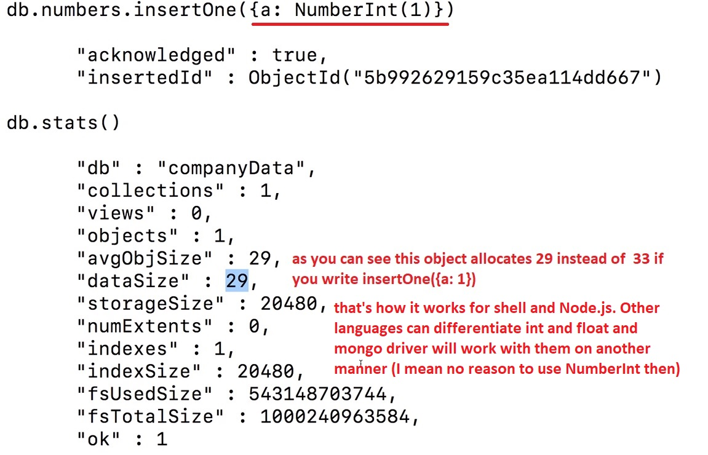
To prove that it stores a number instead of float you can use `typeof db.numbers.findOne().a` command.

* MongoDB has a couple of hard limits - most importantly, a single document in a collection (including all embedded documents it might have) must be <= 16mb. Additionally, you may only have 100 levels of embedded documents.
[additional-info](https://docs.mongodb.com/manual/reference/bson-types/)

1. NumberDecimal creates a high-precision double value => NumberDecimal("12.99")
2. NumberInt creates a int32 value => NumberInt(55)
3. NumberLong creates a int64 value => NumberLong(7489729384792)

Section - 3: Relations

##One to One Relations
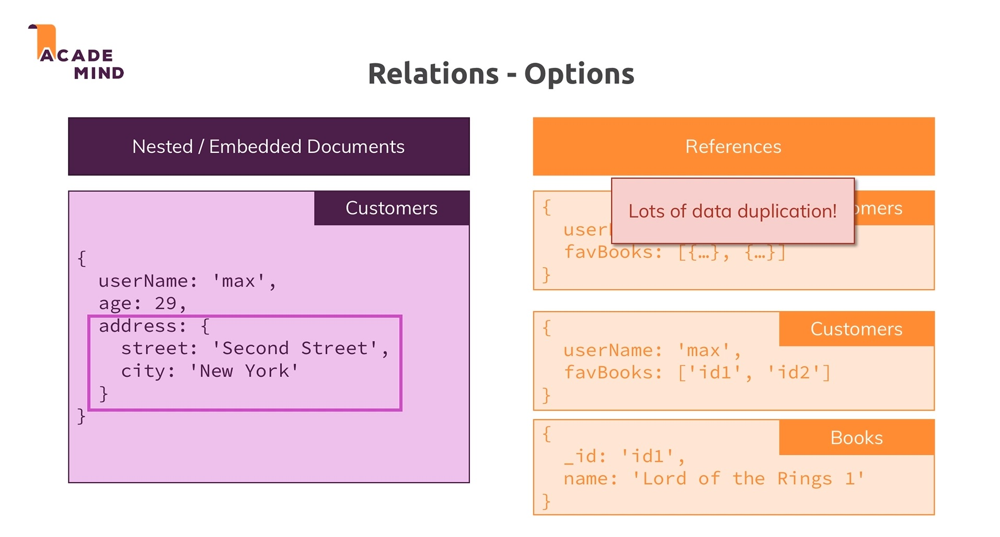
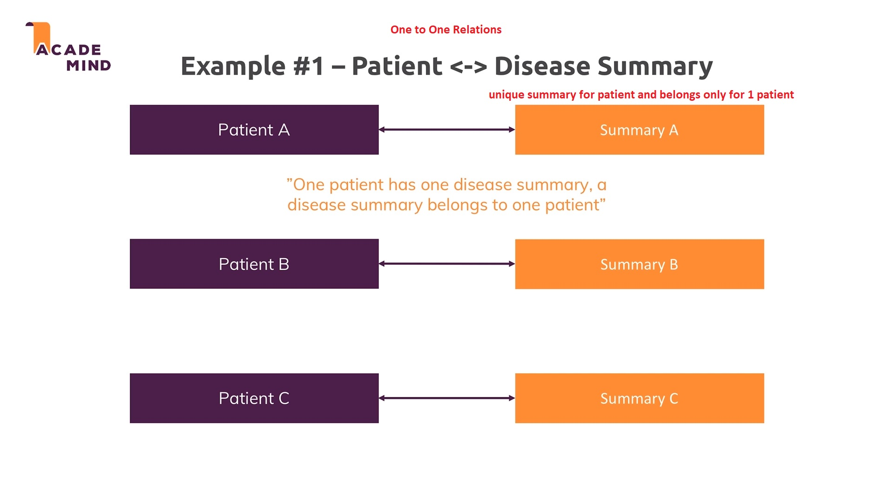
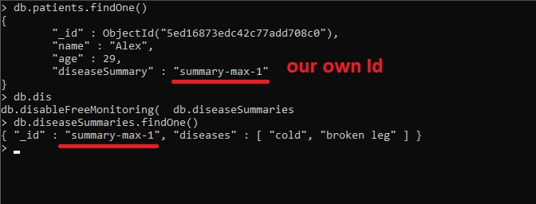

* Example with one-to-one relations and call the data using two steps and variable:

It's not the best option of storing data. In such case better to store data like embedded data inside patient document.
In most cases better to use embedded approach. 

* Another one-to-one examples, but using references. You still opt to use different collections: 
It could be possible useful if you try to analyze your data. And it's very good if your data stores in different
collections (for load balancing, for example. Or because we are interesting only in cars).

##One to Many Relations

* And brief example of ref and embedded approaches:

* Additional example:

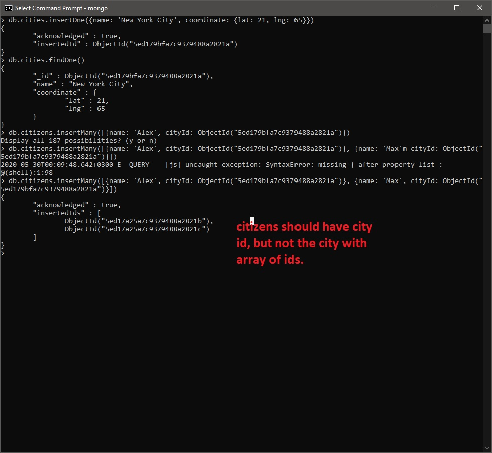

##Many to Many Relations
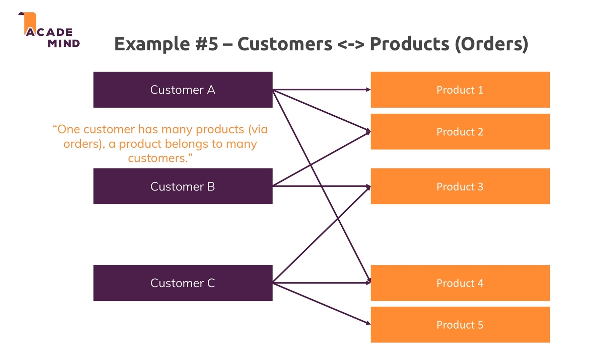
* Sql World approach with 3 tables, one of them stores a joint data:

* MongoDB Approach:

It allows us to use references within one of the data tables.
Advantages from sql and mongo worlds.
Also no reason to use fully embedded approach for some reasons (over-fetching, possible not up-to-date data and so on).

* Summary:
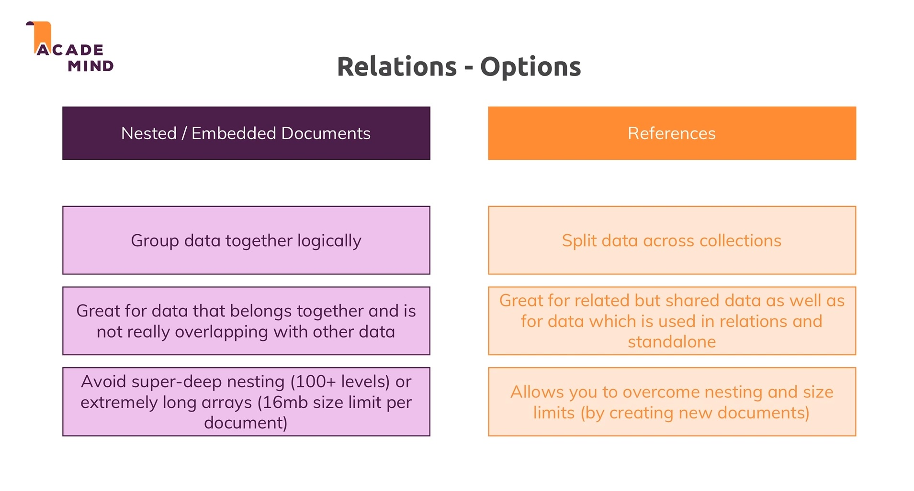

## Merging And Joining with $lookup()

* Initial doc is:

* And the result of aggregate + lookup operator:

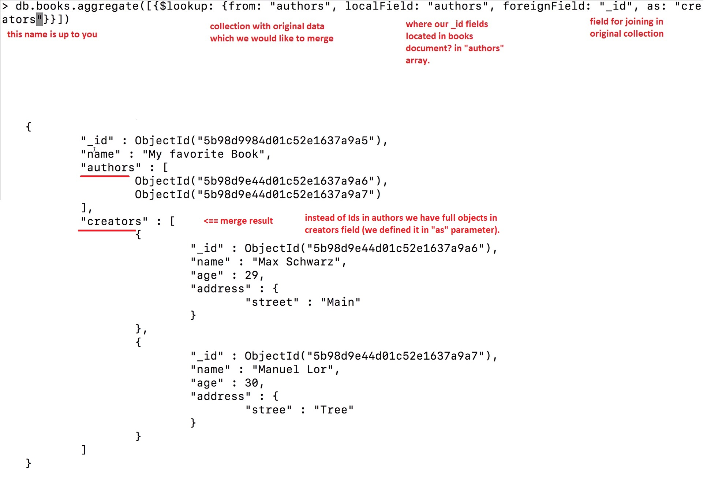

Section - 3: Schema Validation

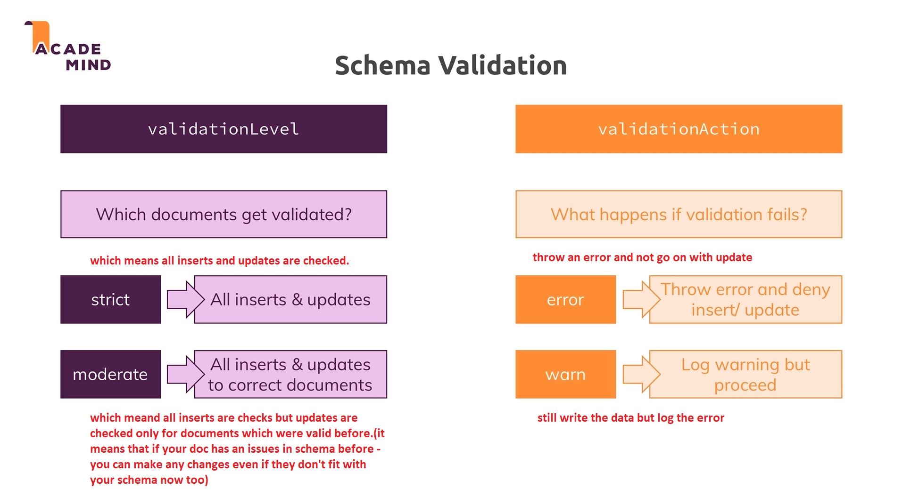

* To declare validation for new collection you have to use explicit collection creation using `createCollection` method.
first  parameter is a new collection name.  
second parameter is its structure: validator + $jsonSchema = validate the schema.
1. Right now $jsonSchema is strongly recommended approach.
2. bsonType: "object" - every coming element should be object-like.
3. required: [] - array of required fields.
4. description - error message.
5. items - you can define nested elements validation.
6. validationAction: 'warn' - only warns you about errors in validation, but not blocks you to send a new document.
<pre>
db.createCollection("newNameOfCollection", {
validator: {
    $jsonSchema: {bsonType: "object", required: ["title", "text", "creator", "comments"], 
    properties: {
     title: { bsonTYpe: "string", description: "must be a string and is required" },
     text: { bsonType: "string", description: "must be a string and is required" },
     creator: { bsonTYpe: "objectId", description: "must be an object and is required" },
     comments: { 
        bsonTYpe: "array",
        description: "must be an array!"
        items: { 
            bsonType: "object",
            required: ["text", "authors"] 
            properties: {
                 text: {
                     bsonType: "string",
                     description: "text must be a string!!"
                 },
                 author: {
                     bsonType: "objectId",
                     description: "author must be an objectId"
                 }
               }
            }
        }
    }
}})
</pre>

* To add\modify validation to already existed collection you have to:
<pre>
db.runCommand({
    collMod: "posts",
    validator: { ...YOUR_VALIDATION_STRUCTURE_AS WE DID BEFORE }
    validationAction: 'warn'
    })
</pre>

this code will succeed. You could see a warning in the log file.(next lecture).

Section 4: MongoDB Settings (As Process and Service), Configuring DB, Log Path

#### mongod parameters

`--directoryperdb` - each db will be stored in a separate directory (under defined by --dbpath)
 Instead of collection of files - collection of nested folders.

* Linux:
`--fork` - fork process. Works only for Linux. 
[mongodb start vs mongod --fork](https://stackoverflow.com/questions/21329618/whats-the-difference-between-service-mongodb-start-and-mongod/48459859)
to kill MongoDB service process: `use admin` to switch to admin database. And `db.shutdownServer()`;

* Windows:
To run background MongoDB as background service: `net start MongoDB`.  
This command provides you ability to run Mongo as background service.
to kill MongoDB service process: `net stop MongoDB`.

### Save your configurations into configuration file

Section 5: Using the MongoDB Compass to Explore Data Visually

